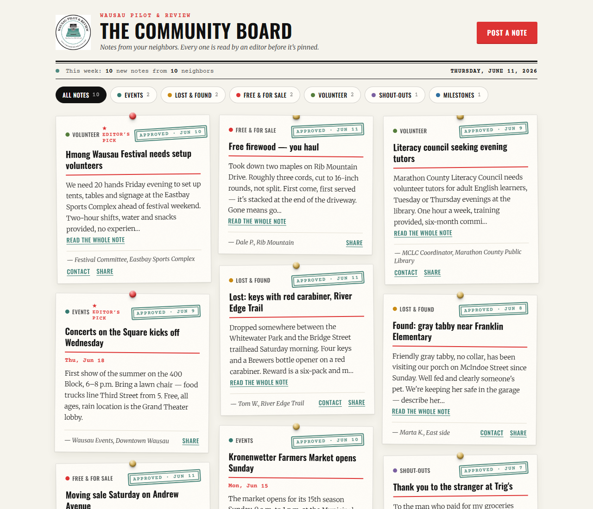

# The Community Board — Wausau Pilot & Review

[](https://github.com/RowanFlynnPilot/wpr-community-board/actions/workflows/deploy.yml)
**[Live board →](https://rowanflynnpilot.github.io/wpr-community-board/)**

A moderated digital bulletin board for the Wausau metro. Neighbors post notes —
events, lost & found, free & for sale, volunteer calls, shout-outs, milestones —
and every note is read by an editor before it's pinned. That editorial review is
the product: it's what a newspaper's bulletin board has that Facebook groups and
Nextdoor never will.



**Stack:** Vite + React frontend on GitHub Pages (same pattern as
`wpr-gas-prices`), Supabase Postgres for data, auth, analytics, and the daily
expiry job. No server, no repo-side cron, $0/month at launch scale. See
`CLAUDE.md` for the architecture rules before changing anything, and
[docs/case-study.md](docs/case-study.md) for the long-form write-up.

## Architecture

Every arrow below is the *only* path of its kind — one way to read, one way
to submit, one way to publish:

```
Reader browser ──read──> board_posts (view)        ── published rows, public columns only
Reader browser ──rpc───> submit_post()             ── the ONLY insert path (honeypot + rate limit)
Editor browser ──rpc───> publish_post()/reject_post() ── the ONLY publish path (computes expires_at)
Editor browser ──table─> posts                     ── pin toggle / take-down / pending copy-edit
All browsers   ──rpc───> log_event()               ── first-party analytics, no PII, rate-limited
pg_cron (daily)─update─> posts                     ── published -> expired past expires_at
```

Anonymous clients have no table grants at all: the published view and two
RPCs (submit a note, log an event) are the entire public surface of the
database.

## Setup

1. **Create the Supabase project** (free tier is fine to start).
2. **Enable pg_cron:** Dashboard → Database → Extensions → enable `pg_cron`.
3. **Run the migrations in order:** paste `supabase/migrations/001_init.sql`
   into the SQL Editor and run it (schema, security policies, RPC functions,
   analytics tables, reporting views, the daily expiry job), then
   `supabase/migrations/002_hardening.sql` (analytics rate limit, event-date
   bounds, clearer publish errors), then
   `supabase/migrations/003_editor_grants.sql` (desk table grants — newer
   Supabase projects don't grant table privileges automatically, and an RLS
   policy alone isn't a grant; without 003 the desk fails with "permission
   denied for table posts"), then
   `supabase/migrations/004_dictation_and_language.sql` (desk dictation via
   the same submit path, plus language-of-session grant metrics).
4. **Seed (dev or demo):** run `supabase/seed.sql` for ten believable Wausau
   posts plus one pending item so the admin queue isn't empty. Dates are
   relative and the script clears its own earlier rows first, so re-run it
   whenever the demo board needs refreshing. Every seed row uses an
   `@example.org` email, so clearing the demo before real launch is one
   line: `delete from posts where contact_email like '%@example.org';`
5. **Create the editor's account:** Dashboard → Authentication → Add user →
   email + password. Turn **off** public sign-ups (Authentication → Providers →
   Email → disable "Allow new users to sign up"). One editor, one account.
6. **Configure the frontend:** `cp .env.example .env`, fill in the project URL
   and anon key from Project Settings → API.
7. `npm install && npm run dev`

> **Free-tier note:** Supabase pauses free projects after about a week with
> no API activity. Real readers keep it awake; before launch, opening the
> board (or the desk) once a week is enough. If it pauses, restore it from
> the Supabase dashboard — nothing is lost.

## The editor's workflow (for Mom)

1. Bookmark the board URL with `#/admin` on the end — that's the desk.
2. Sign in. The **Pending** tab shows everything waiting, newest first, with
   the submitter's email (readers never see it unless the submitter opted in).
   **Write a note** takes dictation: a note phoned in or emailed to the
   newsroom gets typed up under the neighbor's name and lands in Pending
   through the same submission path as everything else (the desk is exempt
   from the 3-per-day limit).
3. **Edit** fixes typos (and, for events, a mistyped date) before a note goes
   up — copy-edit like any newspaper.
4. **Approve & pin to board** publishes it. Events stay up through the day
   after the event; everything else stays up 21 days, then expires on its own
   at 4:17 a.m. No stale garage sales, ever.
5. **Reject** asks for a reason — it's kept on file, not sent to anyone. The
   **Rejected** tab keeps that archive; the **Expired** tab keeps everything
   that has run its course — the source material for a monthly print roundup.
6. On the **Published** tab: **Pin to top** marks a note as an Editor's pick
   (red pin, sorts first), **Copy link** grabs the note's share URL for the
   newsletter, **Take down** removes it (with a confirm step — there's no
   undo from the desk). **Copy newsletter
   snippet** builds the whole weekly "This week on the Community Board"
   block — pinned picks first, deep links included — ready to paste into a
   Newspack Custom HTML block.
7. The **Report** tab is the grant table — one row per month, every metric in
   the proposal (including Español/Hmoob sessions, so the translation work is
   a measured outcome), with a CSV download for the funder report — plus a
   full-archive download: free-tier Supabase keeps no automated backups, so
   grab one after each busy month.
8. **Print roundup:** open the public board and hit Print. The print
   stylesheet lifts the text clamp (full notes), drops pins, shadows, and
   buttons, and lays the cards out two-up — clean enough for the print
   edition or a PDF.

## Deploy (GitHub Pages)

The included workflow builds and deploys on every push to `main`. One-time
setup: repo → Settings → Pages → Source: GitHub Actions, then add two
**Actions secrets** (Settings → Secrets and variables → Actions):
`VITE_SUPABASE_URL` and `VITE_SUPABASE_ANON_KEY`. The anon key is public by
design — row-level security is the boundary, and the migration revokes every
anonymous path except the published view and the two RPCs.

Once the board is embedded on the site, also set the **Actions variable**
`VITE_PUBLIC_URL` to the WordPress page URL so Share links send readers
there instead of the raw GitHub Pages URL.

## Embed in WordPress

See `embed/wordpress-embed.md` for the iframe snippet with auto-height. It's
the same approach as the gas tracker embed.

## Languages

The public board speaks **English, Español, and Hmoob** — a footer toggle,
persisted per browser. Wausau has one of the largest Hmong communities per
capita in the U.S.; lowering the barrier to *contribute* is the point, so
the submit form and house rules are translated, not just the chrome. The
editor's desk stays English.

> **Before announcing the languages publicly:** the Spanish and Hmong
> strings in `src/lib/i18n.js` are first drafts written without native
> review. Have a fluent reader (the Hmong American Center, a bilingual
> staffer) check them — it's one file, plainly laid out, and the review
> itself is a community-engagement story worth telling funders.

There is no i18n framework: one strings object per language, a React
context, and a test that fails if any language is missing a string.

## Analytics & grant reporting

Every interaction is captured first-party in the `events` table via
`log_event()` — board views, post reads, filter use, form opens, submissions,
shares, contact reveals. No cookies, no third parties, no personal data: the
visitor id is a random string in localStorage.

Three views turn raw events into funder-ready numbers:

| View | What it answers |
| --- | --- |
| `monthly_engagement` | Reach and engagement: unique/returning visitors, board views, post reads, shares, connections |
| `monthly_participation` | Who's contributing: submissions, posts published, unique and first-time contributors, average hours from submission to publish |
| `grant_report` | The two joined — one row per month, every metric in the grant proposal's Measurement & Evaluation table |

Monthly export for funders: SQL Editor → `select * from grant_report;` →
Download CSV. The metric definitions match the proposal document one-to-one.

## Development

```bash
npm run dev    # local dev (board at /, desk at /#/admin)
npm run lint   # ESLint (react-hooks rules included)
npm test       # Vitest — incl. the category-enum sync tripwire
npm run build  # static build to dist/
```

Lint and tests run in CI before every deploy; a red check means nothing
ships.

## Design

Type and color come straight from wausaupilotandreview.com and the typewriter
logo: Oswald headings, Merriweather body, Courier Prime as the typewriter
voice, site red `#dd3333`, and teal `#357a71` — sampled from the typewriter
(`#3a867c`), then deepened a step so small teal text clears WCAG AA on the
card cream. Fonts are self-hosted (Fontsource), so no reader request ever
leaves the site. The board, submit dialog, and sign-in audit clean under
axe-core (WCAG 2.1 AA + best-practice rules; `axe-core` ships as a dev
dependency for re-auditing). The signature element is the **editor's stamp** on every card —
`APPROVED · JUN 9` — because human review is the differentiator and the design
should say so. `design/preview.html` is a self-contained comp: open it in any
browser, no build required. Show it to the editor before anything ships.

## License

MIT — see [LICENSE](LICENSE). If you run a local newsroom and want a
community board of your own, fork away; the setup section above is the
whole deployment story.
